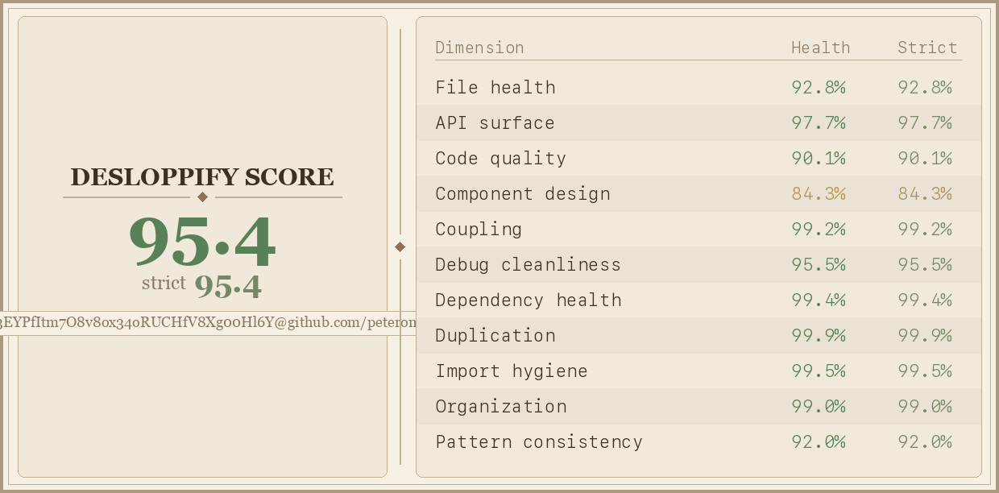

# Reigh

AI-powered image and video generation studio. **For usage, go to [reigh.art](https://reigh.art/)** — this repo is for development only.

---

## Tech Stack

React + Vite + TypeScript · TailwindCSS + shadcn-ui · Supabase (Postgres, Auth, Storage, Edge Functions)

## Quick Start

**Prerequisites:** Node.js 18+, Docker, [Supabase CLI v1+](https://supabase.com/docs/guides/cli)

```bash
git clone https://github.com/peteromallet/reigh
cd reigh && npm install

cp .env .env.local            # or create .env manually
supabase start                # launches Postgres, Auth, Storage, Realtime
# copy the printed SUPABASE_URL, ANON_KEY & SERVICE_ROLE_KEY into .env
supabase db push              # applies migrations

npm run dev                   # Vite on http://localhost:2222
```

GPU task processing requires **[Reigh-Worker](https://github.com/banodoco/Reigh-Worker)** running separately. Worker and API orchestration is managed by **[Reigh-Worker-Orchestrator](https://github.com/banodoco/Reigh-Worker-Orchestrator)**.

## Code Health



## Documentation

| Doc | Purpose |
|-----|---------|
| **[structure.md](structure.md)** | Architecture overview, directory map, links to all sub-docs |
| **[docs/code_quality_audit.md](docs/code_quality_audit.md)** | Quality standards, anti-patterns, metrics, known exceptions |
| **[CLAUDE.md](CLAUDE.md)** | AI agent instructions — working rules, routing table, conventions (symlinked to `.cursorrules`) |
| **[docs/structure_detail/](docs/structure_detail/)** | 24 focused sub-docs covering every system (settings, data fetching, realtime, tasks, etc.) |
